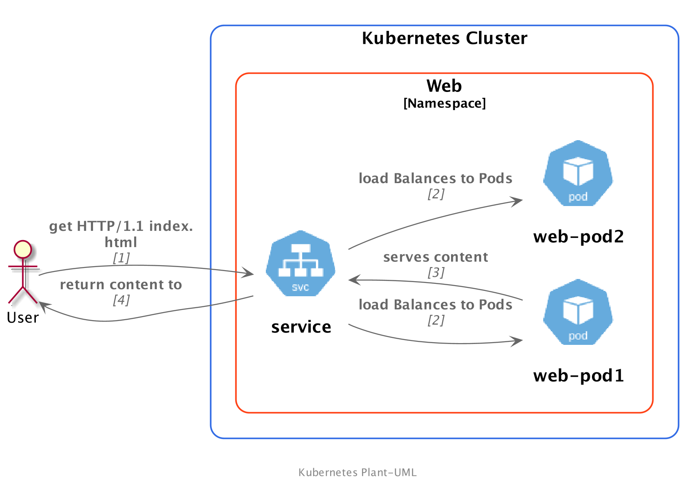
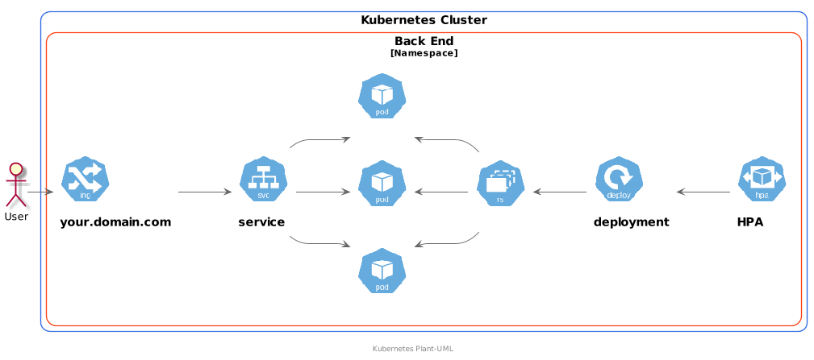
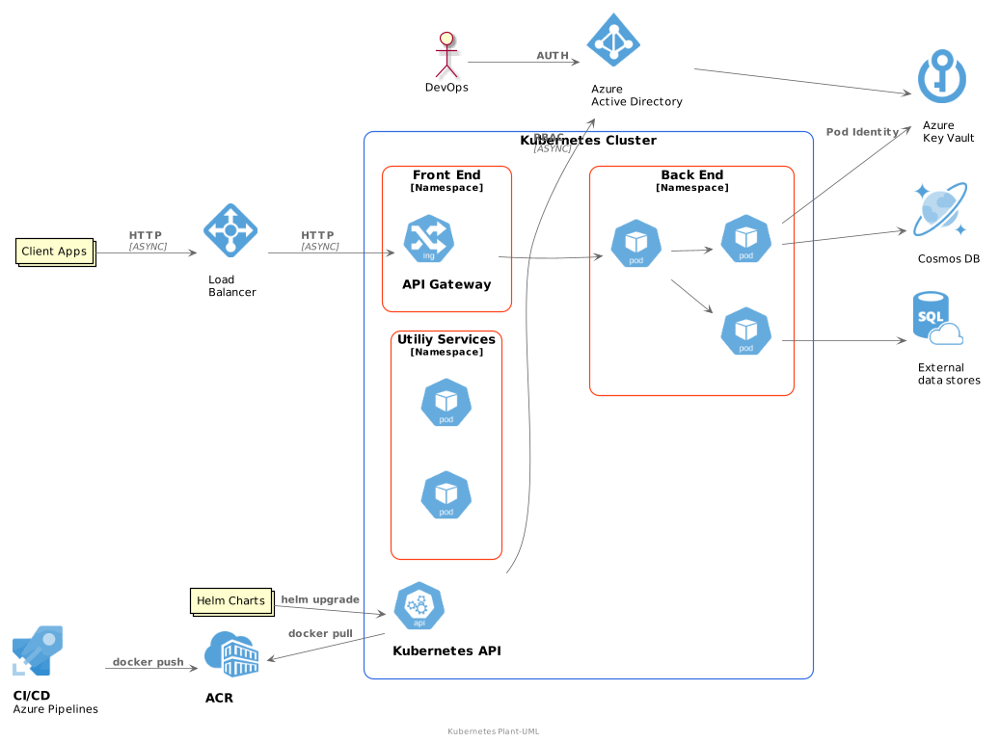

# Kubernetes-PlantUML

These are the PlantUML sprites, macros and stereotypes for creating PlantUML diagrams with the Kubernetes components.
The official Kubernetes Icons Set (where this work is based) can be found [here](https://github.com/kubernetes/community/tree/master/icons)

This repo is heavily influenced by the awesome work from Ricardo Niepel on [Azure-PlantUML](https://github.com/RicardoNiepel/Azure-PlantUML)


**Table of Contents**
- [Kubernetes-PlantUML](#kubernetes-plantuml)
  - [Getting Started](#getting-started)
  - [Examples](#examples)
  - [Using kubernetes-PlantUML with other PlantUML files](#using-kubernetes-plantuml-with-other-plantuml-files)
  - [List of Supported Symbols](#list-of-supported-symbols)
  - [Contributing](#contributing)
  - [Reference](#reference)

## Getting Started

TL;DR - If you're familiar with PlantUML this is what you need:

```vim
' Kubernetes
!define KubernetesPuml https://raw.githubusercontent.com/dcasati/kubernetes-PlantUML/master/dist

' global definition
!includeurl KubernetesPuml/kubernetes_Context.puml
!includeurl KubernetesPuml/kubernetes_Simplified.puml

' k8s specific components
!includeurl KubernetesPuml/OSS/KubernetesPod.puml
!includeurl KubernetesPuml/OSS/KubernetesPsp.puml
!includeurl KubernetesPuml/OSS/KubernetesPv.puml
!includeurl KubernetesPuml/OSS/KubernetesPvc.puml

[...]

```

If you're starting with PlantUML, here's what you need:
  1. VS Code with the PlantUML extension 
  1. [Graphviz](https://graphviz.gitlab.io)
  1. Copy one of the examples from: https://github.com/dcasati/kubernetes-PlantUML/tree/master/samples

I also have an introduction to PlantUML [here](https://github.com/dcasati/better-diagrams)

## Examples

A basic `hello world` example could look like this:



This picture was rendered with the following code:

```vim
@startuml kubernetes

footer Kubernetes Plant-UML
scale max 1024 width

skinparam nodesep 10
skinparam ranksep 10

' Azure
!define AzurePuml https://raw.githubusercontent.com/RicardoNiepel/Azure-PlantUML/release/2-1/dist

!includeurl AzurePuml/AzureCommon.puml
!includeurl AzurePuml/AzureSimplified.puml

' Kubernetes
!define KubernetesPuml https://raw.githubusercontent.com/dcasati/kubernetes-PlantUML/master/dist

!includeurl KubernetesPuml/kubernetes_Context.puml
!includeurl KubernetesPuml/kubernetes_Simplified.puml
!includeurl KubernetesPuml/OSS/KubernetesSvc.puml
!includeurl KubernetesPuml/OSS/KubernetesPod.puml

actor "User" as userAlias
left to right direction

' Kubernetes Components
Cluster_Boundary(cluster, "Kubernetes Cluster") {
    Namespace_Boundary(ns, "Web") {
        KubernetesSvc(svc, "service", "")
        KubernetesPod(pod1, "web-pod1", "")
        KubernetesPod(pod2, "web-pod2", "")
    }
}

Rel(userAlias,svc,"get HTTP/1.1 index.html", "1")
Rel(svc,pod1,"load Balances to Pods", "2")
Rel(svc,pod2,"load Balances to Pods", "2")
Rel_U(pod1, svc, "serves content", "3")
Rel(svc, userAlias, "return content to", "4")
@enduml
```

A more complete example would look like this picture:



and the accompaining code:

```vim
@startuml kubernetes

footer Kubernetes Plant-UML
scale max 1024 width

skinparam nodesep 10
skinparam ranksep 10

' Azure
!define AzurePuml https://raw.githubusercontent.com/RicardoNiepel/Azure-PlantUML/release/2-1/dist

!includeurl AzurePuml/AzureCommon.puml
!includeurl AzurePuml/AzureSimplified.puml

' Kubernetes
!define KubernetesPuml https://raw.githubusercontent.com/dcasati/kubernetes-PlantUML/master/dist


!includeurl KubernetesPuml/kubernetes_Context.puml
!includeurl KubernetesPuml/kubernetes_Simplified.puml

!includeurl KubernetesPuml/OSS/KubernetesApi.puml
!includeurl KubernetesPuml/OSS/KubernetesSvc.puml
!includeurl KubernetesPuml/OSS/KubernetesIng.puml
!includeurl KubernetesPuml/OSS/KubernetesPod.puml
!includeurl KubernetesPuml/OSS/KubernetesRs.puml
!includeurl KubernetesPuml/OSS/KubernetesDeploy.puml
!includeurl KubernetesPuml/OSS/KubernetesHpa.puml

actor "User" as userAlias
left to right direction

' Kubernetes Components
Cluster_Boundary(cluster, "Kubernetes Cluster") {
    Namespace_Boundary(ns, "Back End") {
        KubernetesIng(ingress, "your.domain.com", "")
        KubernetesSvc(svc, "service", "")
        KubernetesPod(pod1, "", "")
        KubernetesPod(pod2, "", "")
        KubernetesPod(pod3, "", "")
        KubernetesRs(rs,"","")
        KubernetesDeploy(deploy,"deployment","")
        KubernetesHpa(hpa, "HPA", "")
    }
}

Rel(userAlias,ingress," ")
Rel(ingress,svc," ")

Rel(svc,pod1," ")
Rel(svc,pod2," ")
Rel(svc,pod3," ")

Rel_U(rs,pod1," ")
Rel_U(rs,pod2," ")
Rel_U(rs,pod3," ")

Rel_U(deploy,rs, " ")
Rel_U(hpa,deploy, " ")

@enduml
```

## Using kubernetes-PlantUML with other PlantUML files

You can certainly mix and match the stencils from kubernetes-PlantUML with other PlantUML files. For instance, 
here is an example of using it with the Azure-PlantUML files to ilustrate this reference architecture 


The equivalent of that in PlantUML would look like this:



```vim
@startuml kubernetes

footer Kubernetes Plant-UML
scale max 1024 width

skinparam nodesep 10
skinparam ranksep 10

' Azure
!define AzurePuml https://raw.githubusercontent.com/RicardoNiepel/Azure-PlantUML/release/2-1/dist

!includeurl AzurePuml/AzureCommon.puml
!includeurl AzurePuml/AzureSimplified.puml

!includeurl AzurePuml/Compute/AzureAppService.puml
!includeurl AzurePuml/Compute/AzureBatch.puml
!includeurl AzurePuml/Containers/AzureContainerRegistry.puml
!includeurl AzurePuml/Containers/AzureKubernetesService.puml
!includeurl AzurePuml/Databases/AzureDatabaseForPostgreSQL.puml
!includeurl AzurePuml/Databases/AzureCosmosDb.puml
!includeurl AzurePuml/Databases/AzureSqlDatabase.puml
!includeurl AzurePuml/DevOps/AzurePipelines.puml
!includeurl AzurePuml/Identity/AzureActiveDirectory.puml
!includeurl AzurePuml/Networking/AzureLoadBalancer.puml
!includeurl AzurePuml/Security/AzureKeyVault.puml
!includeurl AzurePuml/Storage/AzureBlobStorage.puml
!includeurl AzurePuml/Storage/AzureStorage.puml

' Kubernetes
!define KubernetesPuml https://raw.githubusercontent.com/dcasati/kubernetes-PlantUML/master/dist

!includeurl KubernetesPuml/kubernetes_Context.puml
!includeurl KubernetesPuml/kubernetes_Simplified.puml

!includeurl KubernetesPuml/OSS/KubernetesApi.puml
!includeurl KubernetesPuml/OSS/KubernetesIng.puml
!includeurl KubernetesPuml/OSS/KubernetesPod.puml

actor "DevOps" as devopsAlias
collections "Client Apps" as clientalias
collections "Helm Charts" as helmalias

left to right direction

' Azure Components
AzureActiveDirectory(aad, "\nAzure\nActive Directory", "Global")
AzureContainerRegistry(acr, "ACR", "Canada Central")
AzureCosmosDb(cosmos, "\nCosmos DB", "Global")
AzureKeyVault(keyvault, "\nAzure\nKey Vault", "Global")
AzureLoadBalancer(alb, "\nLoad\nBalancer", "Canada Central")
AzureSqlDatabase(sql, "\nExternal\ndata stores", "Canada Central")
AzurePipelines(ado, "CI/CD\nAzure Pipelines", "Global")

' Kubernetes Components
Cluster_Boundary(cluster, "Kubernetes Cluster") {
    KubernetesApi(KubernetesApi, "Kubernetes API", "")
    
    Namespace_Boundary(nsFrontEnd, "Front End") {
        KubernetesIng(ingress, "API Gateway", "")
    }

    Namespace_Boundary(nsBackEnd, "Back End") {
        KubernetesPod(KubernetesBE1, "", "")
        KubernetesPod(KubernetesBE2, "", "")
        KubernetesPod(KubernetesBE3, "", "")
    }

    Namespace_Boundary(nsUtil, "Utiliy Services") {
        KubernetesPod(KubernetesUtil1, "", "")
        KubernetesPod(KubernetesUtil2, "","")
    }
}

Rel(devopsAlias, aad, "AUTH")
Rel(helmalias, KubernetesApi, "helm upgrade")

Rel(aad, keyvault, " ")
Rel(KubernetesApi, aad, "RBAC", "ASYNC")

Rel(clientalias, alb, "HTTP", "ASYNC")
Rel(alb, ingress, "HTTP", "ASYNC")

Rel(ingress, KubernetesBE1, " ")
Rel(KubernetesBE1, KubernetesBE2, " ")
Rel(KubernetesBE1, KubernetesBE3, " ")

Rel(KubernetesBE2, sql, " ")
Rel(KubernetesBE3, keyvault, "Pod Identity")
Rel(KubernetesBE3, cosmos, " ")

Rel(ado, acr, "docker push")
Rel_U(KubernetesApi, acr, "docker pull")


@enduml
```

## List of Supported Symbols
Category | Macro (Name) | <pre>Mono </pre> | Url
  ---    |  ---  | :--- | :---
**OSS** | | | | **OSS/all.puml**
OSS | KubernetesCronjob </br> (Kubernetes Cronjob) |.png?raw=true) | OSS/KubernetesCronjob.puml
OSS | KubernetesGroup </br> (Kubernetes Group) |.png?raw=true) | OSS/KubernetesGroup.puml
OSS | KubernetesPsp </br> (Kubernetes Psp) |.png?raw=true) | OSS/KubernetesPsp.puml
OSS | KubernetesRole </br> (Kubernetes Role) |.png?raw=true) | OSS/KubernetesRole.puml
OSS | KubernetesApi </br> (Kubernetes Api) |.png?raw=true) | OSS/KubernetesApi.puml
OSS | KubernetesJob </br> (Kubernetes Job) |.png?raw=true) | OSS/KubernetesJob.puml
OSS | KubernetesCm </br> (Kubernetes Cm) |.png?raw=true) | OSS/KubernetesCm.puml
OSS | KubernetesMaster </br> (Kubernetes Master) |.png?raw=true) | OSS/KubernetesMaster.puml
OSS | KubernetesKproxy </br> (Kubernetes Kproxy) |.png?raw=true) | OSS/KubernetesKproxy.puml
OSS | KubernetesCrd </br> (Kubernetes Crd) |.png?raw=true) | OSS/KubernetesCrd.puml
OSS | KubernetesDs </br> (Kubernetes Ds) |.png?raw=true) | OSS/KubernetesDs.puml
OSS | KubernetesSc </br> (Kubernetes Sc) |.png?raw=true) | OSS/KubernetesSc.puml
OSS | KubernetesCrb </br> (Kubernetes Crb) |.png?raw=true) | OSS/KubernetesCrb.puml
OSS | KubernetesSched </br> (Kubernetes Sched) |.png?raw=true) | OSS/KubernetesSched.puml
OSS | KubernetesLimits </br> (Kubernetes Limits) |.png?raw=true) | OSS/KubernetesLimits.puml
OSS | KubernetesQuota </br> (Kubernetes Quota) |.png?raw=true) | OSS/KubernetesQuota.puml
OSS | KubernetesVol </br> (Kubernetes Vol) |.png?raw=true) | OSS/KubernetesVol.puml
OSS | KubernetesSa </br> (Kubernetes Sa)|.png?raw=true) | OSS/KubernetesSa.puml
OSS | KubernetesKubelet </br> (Kubernetes Kubelet) |.png?raw=true) | OSS/KubernetesKubelet.puml
OSS | KubernetesPvc </br> (Kubernetes Pvc) |.png?raw=true) | OSS/KubernetesPvc.puml
OSS | KubernetesCcm </br> (Kubernetes Ccm) |.png?raw=true) | OSS/KubernetesCcm.puml
OSS | KubernetesSts </br> (Kubernetes Sts) |.png?raw=true) | OSS/KubernetesSts.puml
OSS | KubernetesNetpol </br> (Kubernetes Netpol) |.png?raw=true) | OSS/KubernetesNetpol.puml
OSS | KubernetesCrole </br> (Kubernetes Crole) |.png?raw=true) | OSS/KubernetesCrole.puml
OSS | KubernetesRs </br> (Kubernetes Rs) |.png?raw=true) | OSS/KubernetesRs.puml
OSS | KubernetesNode </br> (Kubernetes Node) |.png?raw=true) | OSS/KubernetesNode.puml
OSS | KubernetesSecret </br> (Kubernetes Secret) |.png?raw=true) | OSS/KubernetesSecret.puml
OSS | KubernetesNs </br> (Kubernetes Ns) |.png?raw=true) | OSS/KubernetesNs.puml
OSS | KubernetesDeploy </br> (Kubernetes Deploy) |.png?raw=true) | OSS/KubernetesDeploy.puml
OSS | KubernetesUser </br> (Kubernetes User) |.png?raw=true) | OSS/KubernetesUser.puml
OSS | KubernetesPv </br> (Kubernetes Pv) |.png?raw=true) | OSS/KubernetesPv.puml
OSS | KubernetesEp </br> (Kubernetes Ep) |.png?raw=true) | OSS/KubernetesEp.puml
OSS | KubernetesSvc </br> (Kubernetes Svc) |.png?raw=true) | OSS/KubernetesSvc.puml
OSS | KubernetesRb </br> (Kubernetes Rb) |.png?raw=true) | OSS/KubernetesRb.puml
OSS | KubernetesEtcd </br> (Kubernetes Etcd)|.png?raw=true) | OSS/KubernetesEtcd.puml
OSS | KubernetesIng </br> (Kubernetes Ing) |.png?raw=true) | OSS/KubernetesIng.puml
OSS | KubernetesHpa </br> (Kubernetes Hpa) |.png?raw=true) | OSS/KubernetesHpa.puml

## Contributing
I've built this on a necessity that I have for making better diagrams when Kubernetes is part of the solution. This is based on a community effort 
and as such this should belong to the Kubernetes community. Feel free to fork and to submit PRs.

## Reference
None of the work here would be possible without the foundation from Ricardo Niepel, PlantUML and the C4 Model

* Ricardo Niepel - [Azure-PlantUML](https://github.com/RicardoNiepel/Azure-PlantUML)
* C4 Model - [https://c4model.com](https://c4model.com/)